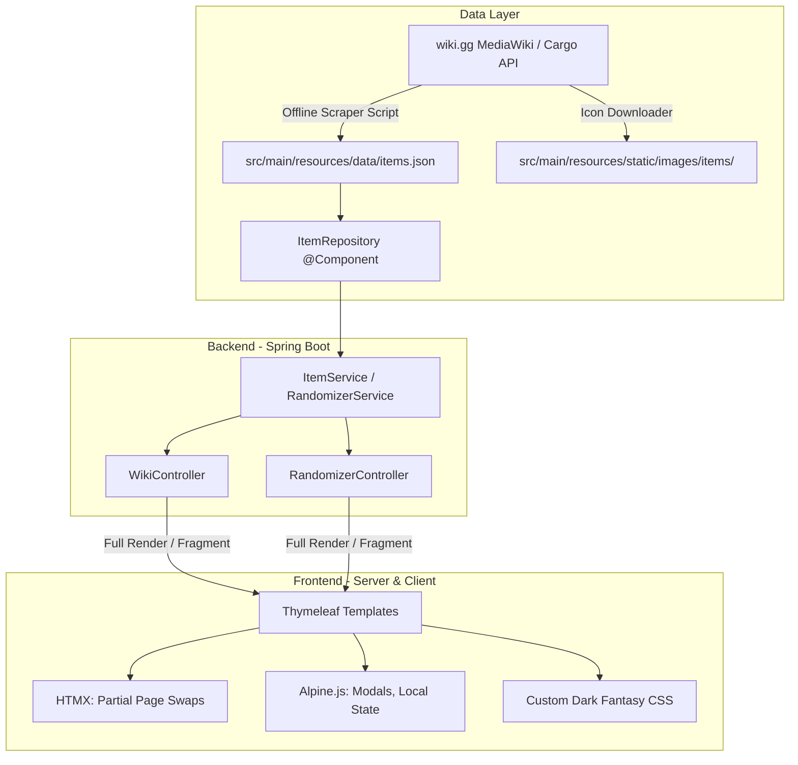

# Witchfire Randomizer & Item Wiki - Architecture & Design Specification

- **Date**: 2026-09-08
- **Status**: Approved
- **Author**: Antigravity & Hendrik

## 1. Context & Motivation

The original application (`WitchfireLoadoutManager`) was built in Next.js. It contained a Savefile Editor, Loadout Manager, Item Wiki, and Loadout Randomizer.

This rewrite migrates the project to a robust, server-rendered stack using **Spring Boot 4 (Java 25)**, **Thymeleaf**, **HTMX**, and **Alpine.js**.
The **Savefile Editor** and **Loadout Manager** are scrapped. The application focuses exclusively on:
1. **Item Wiki**: Complete encyclopedia for Witchfire equipment with search, filtering, detailed stats, and expandable Mysteria tiers.
2. **Loadout Randomizer**: A customizable randomizer supporting slot locks, element preferences, item exclusions, bead stat constraints, and shareable links.

Additionally, the Witchfire game has evolved:
- Dedicated support for **Melee Weapons** (e.g., Fist, Buckler, Katar, Morning Star, Sacring Bell, Zweihander) as a first-class equipment category and randomizer slot.
- Data is extracted systematically via an offline scraper targeting **witchfire.wiki.gg** using its MediaWiki Cargo API.

---

## 2. System Architecture

### 2.1 Technology Stack
- **Runtime & Build**: Java 25, Apache Maven with `./mvnw` wrapper.
- **Backend Framework**: Spring Boot 4.1 (`spring-boot-starter-webmvc`, `spring-boot-starter-thymeleaf`).
- **Frontend Core**: Thymeleaf templates & fragments.
- **Dynamic Interaction**: HTMX (server-driven DOM swaps).
- **Client State & Animations**: Alpine.js (modals, dropdowns, client clipboard, transitions).
- **Styling**: Custom clean CSS without heavyweight node dependencies, preserving the dark fantasy Witchfire aesthetic with polished CSS animations.

---

## 3. Data Model & Ingestion

### 3.1 Domain Models
- **`ItemCategory`**:
  - `WEAPON` (Standard firearms: Close, Medium, Long)
  - `DEMONIC_WEAPON` (Heavy occult weaponry)
  - `MELEE_WEAPON` (Fist, Buckler, Morning Star, etc.)
  - `LIGHT_SPELL`
  - `HEAVY_SPELL`
  - `RELIC`
  - `FETISH`
  - `RING`
  - `BEAD`
- **`Element`**: `FIRE`, `WATER`, `EARTH`, `AIR`, `NONE` (or null).
- **`MysteriumTier`**:
  - `level` (1, 2, or 3)
  - `effect` (String, primarily for weapons)
  - `charismata` (List<String>, for spells/magical items)
  - `requirements` (List<String>)
- **`Item` (Base record / class)**:
  - `id`: unique slug (e.g. `w001-cricket`, `mw-morning-star`)
  - `name`: String
  - `category`: `ItemCategory`
  - `description`: String
  - `iconUrl`: String
  - `element`: `Element`
  - `mysteriumTiers`: `List<MysteriumTier>`
- **`Weapon` (extends Item)**:
  - `rangeCategory`: Close, Medium, Long, Demonic
  - `weaponFamily`: Hand Cannon, Shotgun, Auto Rifle, etc.
  - `damage`, `criticalDamage`, `stunPower`, `adsRange`, `hipfireRange`
  - `rateOfFire`, `reloadSpeed`, `stability`, `mobility`, `magSize`, `ammoReserves`
- **`MeleeWeapon` (extends Item)**:
  - `baseDamage`: int
  - `chargedDamage`: int
  - `specialAttack`: String
  - `specialDamage`: String
  - `location`: String
- **`Bead` (extends Item)**:
  - `requirements`: `List<BeadRequirement>` (e.g., `stat: "Witchery", value: 30`)
- **`Loadout`**:
  - `primaryWeapon`: Item (Weapon)
  - `secondaryWeapon`: Item (Weapon, non-identical to primary)
  - `demonicWeapon`: Item (Weapon, Demonic)
  - `meleeWeapon`: Item (MeleeWeapon)
  - `lightSpell`: Item (Spell)
  - `heavySpell`: Item (Spell)
  - `relic`: Item (MagicalItem)
  - `fetish`: Item (MagicalItem)
  - `ring`: Item (MagicalItem)
  - `beads`: `List<Bead>` (up to 5)

### 3.2 Scraper Specification
- Script: `scripts/scrape_wiki.py` (or Java CLI equivalent).
- Source: `https://witchfire.wiki.gg/api.php` with custom `User-Agent`.
- Target tables:
  - `cargoquery?tables=Weapons`
  - `cargoquery?tables=MeleeWeapons`
  - `cargoquery?tables=Spells`
  - `cargoquery?tables=MagicalItems`
  - `cargoquery?tables=Beads`
- Wikitext parsing for `{{Mysteria ...}}` to populate M1/M2/M3 requirements and effects.
- Output: `src/main/resources/data/items.json` and static icon downloads into `src/main/resources/static/images/items/`.

---

## 4. Web Endpoints & UI Design

### 4.1 Endpoints
- `GET /`: Redirects to `/randomizer` (or serves randomizer directly).
- `GET /randomizer`: Serves main randomizer page with initial generated loadout.
- `POST /randomizer/reroll`:
  - Request body / form: lock states per slot, preferred elements, excluded item IDs, bead user stats.
  - Response: HTMX fragment replacing `#loadout-grid`.
- `POST /randomizer/reroll-slot`:
  - Rerolls a single slot without touching other slots.
- `GET /wiki`: Serves main wiki catalog page.
- `GET /wiki/items`:
  - Query params: `category`, `element`, `search`.
  - Response: HTMX fragment replacing `#wiki-items-grid`.
- `GET /wiki/item/{id}`:
  - Response: Modal detail fragment displaying complete stats, lore, and Mysteria tiers.

### 4.2 Styling & Aesthetics
- **Theme**: Witchfire Gothic Dark Fantasy (`#1A1A1A`, `#262626`, accents in `#ddaf7a` and `#ffcb8a`).
- **Assets**: Background image (`wf-bg.webP`), subtle parchment texture (`texture-transparent.PNG`), lock icons (`lockOpen.png`, `lockClosed.png`).
- **Animations**:
  - `glow-pulse` and smooth border transitions for locked/hovered slots.
  - Fade/slide transitions on HTMX slot swaps.
  - Accordion transitions for Mysteria tiers in item cards.

---

## 5. Verification & Testing Strategy
- Unit tests for `ItemRepository`: JSON deserialization, category filtering, element filtering.
- Unit tests for `RandomizerService`:
  - Slot selection rules (Primary != Secondary).
  - Slot locking preserves designated items.
  - Elemental preference matching.
  - Bead stat constraint filtering.
- Controller integration tests with MockMvc:
  - `/wiki` and `/wiki/items` return expected HTML fragments and HTTP 200.
  - `/randomizer` and `/randomizer/reroll` return valid loadout fragments.
- Run `./mvnw test` before marking any completion.
